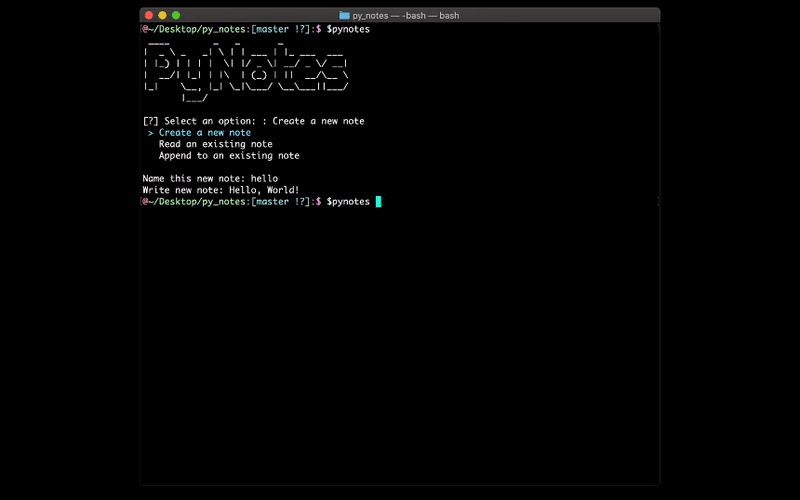

Pynotes is a command-line utility for fast note-taking from anywhere in the shell. It has two modes: an interactive GUI, and a UNIX-style 'flags' argument parser. Here's a demo:

Pynotes first checks for a required configuration file that tells it where in the host's file system to store the notes. If this file does not exist, it is generated; user input is solicited to designate the storage directory, which will subsequently be stored in the root 'path' variable for each session of Pynotes. This means Pynotes can coorelate to several users across a single filesystem. I intend to add a module for file permissions mgmt to Pynotes nigh in the future.

Pynotes uses argparse to accept flag options from the command-line. To create a new note, use the `-n` flag followed by the name of the new note, followed by an optional `-c` followed by note content in parens. e.g. `pynotes -n newnotename -c "new note content"`

To add to an existing note using argparse, use the `-a` flag e.g. `pynotes -a noteyouwanttoedit -c "adding more content..."`

Finally, to read a note from the command-line, use the `-r` flag e.g. `pynotes -r noteyouwanttoread`

OR, you can just fire up pynotes with `pynotes` (make sure you store the binary in your PATH!!!) and use the fancy GUI made with Inquirer.py.

Enjoy.
